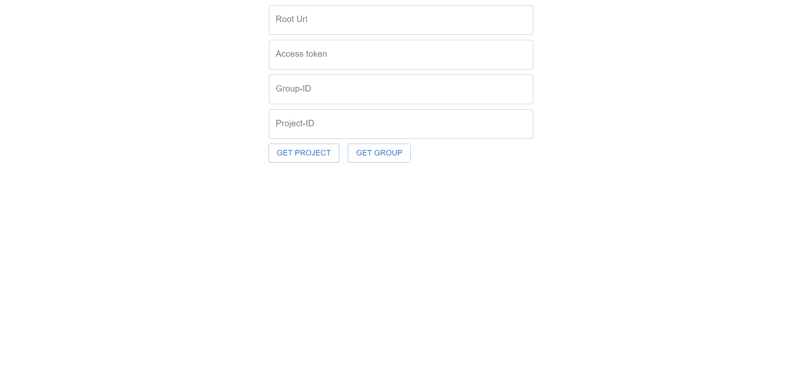
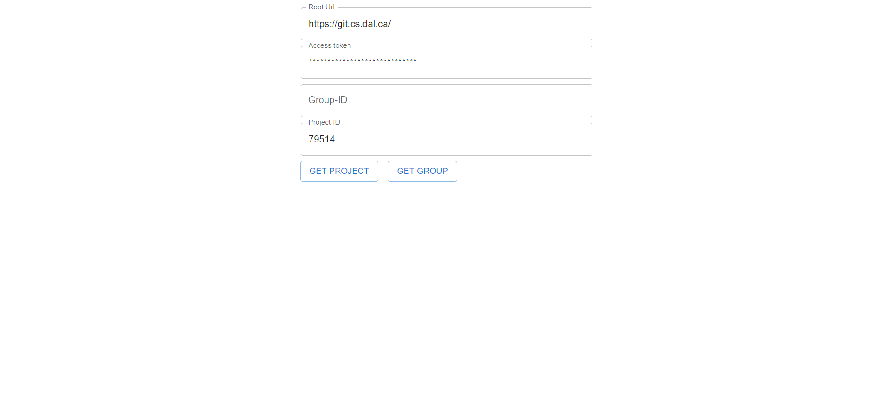
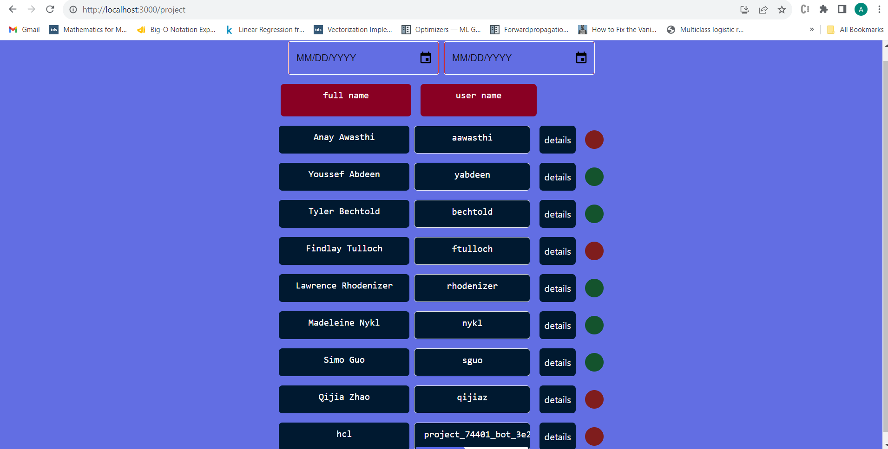
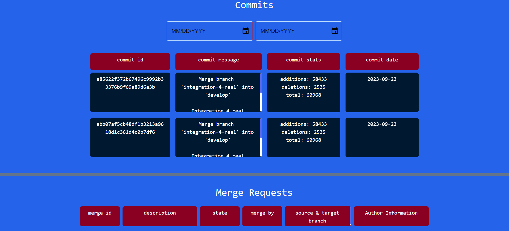
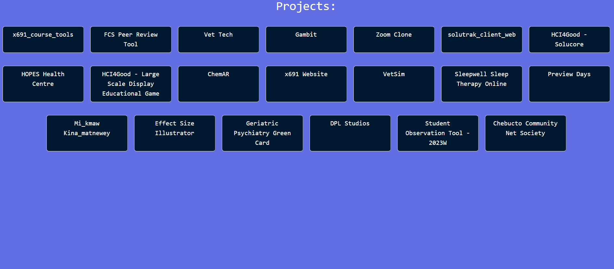

[LinkedIn](https://www.linkedin.com/in/anas-malvat-8a95b81a3/)

<!-- TABLE OF CONTENTS -->

  
Table of Contents

  <ol>
    <li>
      <a href="#about-the-project">About The Project</a>
      <ul>
        <li><a href="#built-with">Built With</a></li>
      </ul>
    </li>
    <li>
      <a href="#getting-started">Getting Started</a>
    </li>
    <li><a href="#usage">Usage</a></li>
  </ol>

<!-- ABOUT THE PROJECT -->
## About The Project

Welcome to the GitLab Visualization Tool, a powerful yet simple application developed using React.js, Node.js, Express.js, and Tailwind CSS. This tool allows you to gain valuable insights into GitLab activities, enabling you to monitor user actions and project progress effortlessly.

Features:

* User-Friendly Interface: The tool provides an intuitive interface that makes it easy to navigate and explore GitLab activities.

* Project Specifics: You can check user activities within specific projects, allowing you to monitor commits, merge requests, and more.

* Group-wide Search: Search across entire groups to find projects of interest, and delve into the specific activities within those projects.

* Date Filtering: Filter commits and merge requests by date, providing a detailed timeline of project activities.

* Notification Signals: Stay informed about user activity levels with notification signals. A red signal indicates inactivity, yellow signifies moderate activity, and green represents high user engagement on GitLab.

### Built With

* React.js: A robust JavaScript library for building user interfaces, ensuring a smooth and interactive experience.

* Node.js: A powerful runtime environment for server-side applications, enabling efficient handling of backend processes.

* Express.js: A minimal and flexible Node.js web application framework that simplifies building robust APIs.

* Tailwind CSS: A utility-first CSS framework that streamlines the styling process and ensures responsive designs.

### Prerequisites

Before you begin, ensure you have met the following requirements:

* Node.js and npm: Install Node.js from nodejs.org and npm will be included.

* Git: Download and install Git from git-scm.com.

* GitLab Account and Personal Access Token: You need a GitLab account to generate a personal access token. Create one from your GitLab account settings of a porject of group.

## Getting Started

Follow following steps for setting up your project locally.

git clone https://github.com/ANASMALVAT/gitlab-visualization.git

    * navigate to gitlabx691

    npm install --legacy-peer-deps

    npm start

    * navigate to gitlabx691-backend

    npm install
    
    npm start

After following this steps you will have frontend running on port 3000 and backed running on port 5000 locally.

<!-- USAGE EXAMPLES -->
## Usage
In the home page you will see the following screen:

Now to check activities of specific project, you will enter the base url where the project is, you will enter the secret token and the project-ID as shown below 

Then you will be able to see the following information of the project!

You can hover on signal button to check the activity. You can also click on detail button to check the details of commits and merge of the user. As shown below:

For Group search you will do the same thing but with group access token and group-ID.

Following is the result for the group search:

From here you can see the activity of all the projects. 
